<div align="center">

<!-- BANNER — click opens live dashboard -->
<a href="https://xchrmas.github.io/Cryptocurrency-Bots/" target="_blank">
  
</a>

<br/>

[](https://dotnet.microsoft.com)
[](https://learn.microsoft.com/en-us/dotnet/csharp/)
[](https://github.com/JKorf/Binance.Net)
[](https://serilog.net)
[](https://spectreconsole.net)
[](https://github.com/DaveSkender/Stock.Indicators)
[](https://github.com/App-vNext/Polly)
[](https://numerics.mathdotnet.com)
[](https://github.com/WireMock-Net/WireMock.Net)
[](https://xunit.net)
[](https://benchmarkdotnet.org)
[](https://fluentassertions.com)
[](LICENSE)
[](CONTRIBUTING.md)

<br/>

> **Production-grade algorithmic trading system** built on a clean, fully async architecture.
> Five independent strategy engines, unified risk framework, real-time WebSocket feeds, Binance Public API integration,
> and an AI-readable diagnostics stream — all running concurrently on `System.Threading.Channels`.

</div>

---

## Table of Contents

- [Architecture](#-architecture)
- [Trading Strategies](#-trading-strategies)
- [Risk Management](#-risk-management)
- [Market Scanner](#-market-scanner)
- [Binance Public API Integration](#-binance-public-api-integration)
- [Order Execution Engine](#️-order-execution-engine)
- [AI-Readable Live Stream](#-ai-readable-live-stream-module)
- [Paper Trading & Kill Switch](#-paper-trading--kill-switch)
- [Technical Stack](#-technical-stack)
- [Getting Started](#-getting-started)
- [Configuration](#️-configuration)
- [Project Structure](#-project-structure)

---

## 🏗 Architecture

The system is built around a **pipeline-per-strategy** model. Each strategy runs in its own isolated `Channel<MarketEvent>` pipeline, decoupled from the WebSocket ingress layer. The global risk bus sits above all pipelines and can terminate any or all of them via a `CancellationToken` cascade.

```
  ┌─────────────────────────────────────────────────────────────┐
  │                  Binance WebSocket Feed                      │
  │      (BookTicker · Kline · AggTrade · Depth · UserData)     │
  └───────────────────────┬─────────────────────────────────────┘
                          │  MarketEvent
              ┌───────────▼───────────┐
              │   Market Data Router  │  ← normalizes + fans out
              └──┬──┬──┬──┬──┬───────┘
                 │  │  │  │  │
       ┌─────────▼┐ │  │  │  └────────────────────┐
       │ SpotGrid │ │  │  └──────────────┐         │
       │ Pipeline │ │  └──────┐          │         │
       └────┬─────┘ │         │          │         │
            │  ┌────▼──────┐  │  ┌───────▼──┐  ┌──▼──────┐
            │  │Martingale │  │  │  TWAP    │  │TradFi   │
            │  │ Pipeline  │  │  │ Pipeline │  │Combo/DCA│
            │  └────┬──────┘  │  └────┬─────┘  └──┬──────┘
            │       │     ┌───▼──┐    │            │
            │       └────►│ Risk │◄───┘◄───────────┘
            └────────────►│ Bus  │
                          └──┬───┘
                             │ ExecutionCommand
                          ┌──▼──────────────┐
                          │  Order Router   │  ← rate-limit aware
                          │  (REST / WS)    │
                          └──┬──────────────┘
                             │
                    ┌────────▼────────┐
                    │  Binance API    │
                    │  Spot / Futures │
                    └─────────────────┘
```

**Key architectural decisions:**

- **`System.Threading.Channels`** — bounded back-pressure channels prevent memory bloat under market volatility spikes
- **Zero shared mutable state** — each pipeline owns its state; the risk bus communicates only via immutable messages
- **`IHostedService` + `BackgroundService`** — full .NET Generic Host lifecycle management with graceful shutdown
- **MVC per strategy** — `MarketController` → `StrategyModel` → `ExecutionView`; testable in isolation
- **`ValueTask` over `Task`** — allocation-free hot paths in the market data ingestion loop

---

## 📈 Trading Strategies

### 1 · Spot Grid Bot Pro

Places a ladder of limit orders above and below a reference price, capturing oscillation profit in range-bound markets.

```
Price │  ████ SELL @ 43 200    ← grid level 5
      │  ████ SELL @ 43 000    ← grid level 4
 ─────┼──────────────────────  ← mid price
      │  ████  BUY @ 42 800    ← grid level 3
      │  ████  BUY @ 42 600    ← grid level 2
      │  ████  BUY @ 42 400    ← grid level 1
```

| Parameter | Default | Description |
|-----------|---------|-------------|
| `GridLevels` | 10 | Number of buy/sell levels |
| `GridSpacingPct` | 0.5% | Distance between levels |
| `BaseOrderSize` | dynamic | Scaled by `DynamicPositionSizing` |
| `RangeRecalcInterval` | 4 h | ATR-based range recalculation |

**Indicators used:** ATR(14) for range detection · EMA(200) for trend bias · VWAP for mid-price anchor

---

### 2 · Futures Martingale

Doubles (or multiplies by a configurable factor) position size after each losing trade, targeting a single recovery candle. Hard limits cap maximum exposure.

> ⚠️ High-risk strategy. Designed for use with the **Global Drawdown Limit** and **BTC Trend Filter** active.

| Parameter | Default | Description |
|-----------|---------|-------------|
| `BaseSize` | 1× | Initial position multiplier |
| `Multiplier` | 1.8× | Position scale factor on loss |
| `MaxLevels` | 4 | Hard cap on cascade depth |
| `ResetOnTP` | true | Resets multiplier after take-profit |

---

### 3 · TWAP Bot (Time-Weighted Average Price)

Splits a large parent order into equal child slices, executed at regular intervals. Minimises market impact and execution cost for block entries/exits.

```csharp
// Core execution loop
await foreach (var slice in _scheduler.SlicesAsync(parentOrder, cancellationToken))
{
    var price = await _feed.GetMidPriceAsync(slice.Symbol);
    await _executor.PlaceAsync(slice with { Price = price });
    _metrics.Record(slice, price);
}
```

**Features:** Randomised slice timing (±15% jitter) to avoid predictable patterns · VWAP deviation guard pauses execution if price deviates > N% from session VWAP

---

### 4 · DCA (Dollar-Cost Averaging)

Scheduled, price-condition-triggered accumulation. Supports both time-based (`every 4 h`) and dip-triggered (`buy when price drops 3% from last entry`) modes.

| Mode | Trigger | Use case |
|------|---------|----------|
| `TimeBased` | Cron schedule | Passive accumulation |
| `DipBased` | Price decline % | Entry on weakness |
| `Hybrid` | Time + dip filter | Best of both |

---

### 5 · TradFi Combo

Blends classical institutional techniques: **momentum** (12/26 EMA crossover), **mean-reversion** (Bollinger Band % B), and **carry** (funding rate arbitrage on perpetuals). Weights are dynamically rebalanced every 24 h using a simplified Kelly Criterion.

---

## 🛡 Risk Management

Risk is enforced at two layers: **per-strategy** (soft limits) and **global bus** (hard limits with immediate halt).

### Dynamic Position Sizing

Position size is computed per trade using a volatility-adjusted Kelly formula:

```
f* = (W · R − L) / R
size = AccountEquity × f* × VolatilityScalar
```

Where `VolatilityScalar = ATR(14)_baseline / ATR(14)_current` — shrinks size in high-volatility regimes automatically.

### Trailing Stop-Loss & Take-Profit

```
TrailingStop:
  activation: +1.2%        # activates once position is profitable
  trail_distance: 0.6%     # trails at 0.6% below peak price
  time_lock: 5m             # minimum hold before trailing activates

TakeProfit:
  tp1: +2.0%  → close 40%
  tp2: +4.0%  → close 35%
  tp3: +8.0%  → close 25%   # runner position
```

### Global Drawdown Limit

If total portfolio drawdown from peak equity exceeds the configured threshold, **all strategies halt immediately** and all open positions are optionally liquidated (configurable).

```json
"GlobalRisk": {
  "MaxDrawdownPct": 8.0,
  "DailyLossLimitPct": 3.0,
  "HaltOnBreach": true,
  "LiquidateOnHalt": false
}
```

### BTC Trend Filter

A macro regime filter: strategies with `RequiresBullMarket: true` are suspended when BTC closes below EMA(200) on the daily chart. Resumes automatically when the condition clears.

### Volume & Liquidity Filter

Rejects entry signals on symbols where:
- 24 h volume < `MinVolumeUsd` threshold
- Bid/ask spread > `MaxSpreadBps` basis points
- Order book depth at ±0.5% < `MinDepthUsd`

### Volatility Filter

Suppresses trading during abnormal volatility events (e.g. FOMC, CPI releases):
- `ATR%` > `MaxAtrThreshold` → pause all entries
- Configurable pre/post news blackout windows via `EconomicCalendar` integration

### Whitelist / Blacklist

```json
"SymbolFilter": {
  "Whitelist": ["BTCUSDT", "ETHUSDT", "SOLUSDT"],
  "Blacklist": ["LUNAUSDT"],
  "AllowNewListings": false,
  "MinMarketCapRank": 50
}
```

---

## 🔍 Market Scanner

Scans the full Binance universe on a configurable interval, scoring symbols against a multi-factor ranking model:

| Factor | Weight | Signal |
|--------|--------|--------|
| Volume surge (vs 20-day avg) | 30% | Momentum confirmation |
| Volatility regime (ATR%) | 25% | Strategy fit score |
| Spread tightness | 20% | Execution cost |
| Trend strength (ADX) | 15% | Directional clarity |
| Funding rate (futures) | 10% | Carry signal |

Emits `ScanResult` events consumed by each strategy's allocation controller. Strategies self-select symbols above their minimum score threshold.

---

## 🌐 Binance Public API Integration

The system consumes **Binance Public REST & WebSocket APIs** for real-time market data — no authentication required for read-only feeds. All data is streamed into `System.Threading.Channels` pipelines and processed asynchronously.

### REST Endpoints Used

| Endpoint | Data | Update Frequency |
|----------|------|-----------------|
| `GET /api/v3/klines` | OHLCV candlestick data (1m → 1M) | On demand / polling |
| `GET /api/v3/ticker/24hr` | 24h price, volume, trade count | Every 4 s |
| `GET /api/v3/depth` | Order book bids & asks (limit 5–1000) | Every 4 s |
| `GET /api/v3/trades` | Recent trades list | On demand |
| `GET /api/v3/avgPrice` | Current average price | On demand |

### WebSocket Streams

Real-time data arrives via persistent WebSocket connections managed by `Binance.Net`. Each stream is bound to a dedicated `Channel<T>` with configurable bounded capacity.

```csharp
// Kline / candlestick stream
await _binanceSocketClient.SpotApi.ExchangeData
    .SubscribeToKlineUpdatesAsync("BTCUSDT", KlineInterval.OneMinute, data =>
    {
        _klineChannel.Writer.TryWrite(data.Data);
    }, cancellationToken);

// Order book depth stream (20 levels, 100ms updates)
await _binanceSocketClient.SpotApi.ExchangeData
    .SubscribeToOrderBookUpdatesAsync("BTCUSDT", 20, data =>
    {
        _depthChannel.Writer.TryWrite(data.Data);
    }, cancellationToken);

// Aggregate trade stream
await _binanceSocketClient.SpotApi.ExchangeData
    .SubscribeToAggregatedTradeUpdatesAsync("BTCUSDT", data =>
    {
        _aggTradeChannel.Writer.TryWrite(data.Data);
    }, cancellationToken);
```

### Indicators Computed from Live Data

| Indicator | Source stream | Period |
|-----------|--------------|--------|
| RSI | Kline close | 14 |
| EMA fast / slow | Kline close | 12 / 26 |
| EMA trend | Kline close | 50 / 200 |
| MACD | Kline close | 12 / 26 / 9 |
| ATR | Kline H/L/C | 14 |
| VWAP | AggTrade price × volume | Session |
| Bollinger Bands | Kline close | 20, 2σ |
| ADX | Kline H/L/C | 14 |
| Funding Rate | REST `/fapi/v1/fundingRate` | 8 h |

### Rate Limit Compliance

Binance enforces a **1200 weight/minute** limit on REST and **300 connections** on WebSocket. The `RateLimitBucket` component tracks consumed weight from `X-MBX-USED-WEIGHT-1M` response headers and queues requests when approaching limits:

```csharp
public sealed class RateLimitBucket
{
    private readonly SemaphoreSlim _gate;
    private int _usedWeight;

    public async Task<T> ExecuteAsync<T>(
        int weight,
        Func<Task<T>> request,
        CancellationToken ct)
    {
        await _gate.WaitAsync(ct);
        try
        {
            if (_usedWeight + weight > 1100) // 100 weight safety margin
                await Task.Delay(_refillDelay, ct);

            var result = await request();
            _usedWeight += weight;
            return result;
        }
        finally { _gate.Release(); }
    }
}
```

---

## ⚙️ Order Execution Engine

### API Rate Limit Manager

Implements a **token-bucket** algorithm per endpoint weight class, with automatic request queuing and retry-after parsing from `429` responses:

```csharp
public sealed class RateLimitBucket
{
    // Refills at Binance's 1200 weight/min cadence
    // Queues requests instead of dropping them
    // Propagates X-MBX-USED-WEIGHT headers back to all strategies
}
```

### WebSocket Order Updates

Order state is tracked exclusively via `executionReport` user data stream — **no polling**. Provides sub-100 ms fill confirmation latency.

### Time-in-Force Parameters

| TIF | Use case |
|-----|----------|
| `GTC` | Grid bot limit orders |
| `IOC` | TWAP slice execution |
| `FOK` | Martingale recovery entries |
| `GTX` | Post-only maker orders (fee optimisation) |

---

## 🤖 AI-Readable Live Stream Module

A structured JSON logging module that broadcasts the bot's complete state in real time. Designed for **zero-context diagnostics** — paste the last 20 lines into any AI chat for instant analysis.

### Stream format

Each line is a self-contained JSON object (NDJSON / JSON Lines):

```json
{
  "ts": "2024-01-15T14:32:07.841Z",
  "seq": 18420,
  "market": {
    "sym": "BTCUSDT",
    "price": 42817.30,
    "spread_bps": 1.2,
    "atr_pct": 0.83,
    "vol_24h_usd": 1840000000,
    "vwap": 42650.10,
    "regime": "ranging"
  },
  "indicators": {
    "ema_fast": 42790.4,
    "ema_slow": 42510.8,
    "rsi_14": 53.2,
    "bb_pct_b": 0.61,
    "adx": 18.4,
    "macd": 0.42,
    "funding_rate_pct": 0.012
  },
  "positions": [
    {
      "id": "g-007",
      "strategy": "SpotGrid",
      "side": "LONG",
      "entry": 42400.00,
      "size_usd": 214.50,
      "pnl_pct": 0.98,
      "pnl_usd": 2.10,
      "age_min": 47
    }
  ],
  "risk": {
    "equity": 10214.50,
    "drawdown_pct": 1.24,
    "daily_loss_pct": 0.31,
    "open_risk_usd": 214.50,
    "halt": false
  },
  "decision": {
    "strategy": "SpotGrid",
    "action": "hold",
    "reason": "price_within_grid_range",
    "confidence": 0.87,
    "blocked_by": null,
    "next_eval_ms": 1200
  }
}
```

### Diagnostic usage

```bash
# Terminal — tail last 20 lines, pretty-print
tail -n 20 logs/stream.jsonl | jq .

# Compact — copy-paste to AI chat (single line per event)
tail -n 20 logs/stream.jsonl
```

> **AI prompt template:**
> *"Here are the last 20 state lines from my trading bot. Analyse the decision logic, identify any anomalies in the indicators or risk metrics, and suggest corrections:"*
> *(paste 20 lines)*

### Sink configuration (Serilog)

```csharp
Log.Logger = new LoggerConfiguration()
    .WriteTo.File(
        path: "logs/stream.jsonl",
        formatter: new AiStreamFormatter(),   // custom compact JSON formatter
        rollingInterval: RollingInterval.Hour,
        retainedFileCountLimit: 48,
        buffered: false)                      // flush every line — no buffering
    .WriteTo.Spectre()                        // Spectre.Console live dashboard
    .CreateLogger();
```

---

## 🧪 Paper Trading & Kill Switch

### Paper Trading (Simulation Mode)

Full simulation with realistic fill modelling — no live orders placed.

```json
"Simulation": {
  "Enabled": true,
  "SlippageModelBps": 1.5,
  "PartialFillProbability": 0.12,
  "LatencySimulationMs": 45,
  "InitialVirtualBalance": 10000.0
}
```

Paper trading uses the **same code paths** as live mode. The only difference is `IOrderExecutor` is bound to `SimulatedOrderExecutor` via DI. Switch to live with a single config flag — no code changes.

### Kill Switch (Emergency Stop)

Three trigger mechanisms:

```
1. API call:   POST /control/halt
2. Keyboard:   Ctrl+Q in Spectre.Console dashboard
3. Automatic:  GlobalDrawdownLimit breach
```

On activation:
1. Cancels all strategy `CancellationToken`s simultaneously
2. Cancels all open limit orders via Binance REST (with retry)
3. Optionally closes positions at market (configurable per strategy)
4. Writes final state snapshot to `logs/halt_state.json`
5. Sends alert via configured notifier (Telegram / email)

```csharp
// Kill switch is a first-class citizen — injected everywhere
public interface IKillSwitch
{
    CancellationToken Token { get; }
    void Engage(HaltReason reason);
    event EventHandler<HaltEventArgs> Engaged;
}
```

---

## 🛠 Technical Stack

### Core Runtime

| Technology | Version | Role |
|-----------|---------|------|
| .NET | 8.0 | Runtime & async model |
| C# | 12.0 | Language |
| `System.Threading.Channels` | built-in | Back-pressure pipeline |
| `IHostedService` / `BackgroundService` | built-in | Lifecycle management |
| `ValueTask` | built-in | Allocation-free hot paths |

### Market Data & Exchange

| Library | Version | Purpose |
|---------|---------|---------|
| `Binance.Net` | 10.x | REST + WebSocket client, full Spot & Futures API |
| `CryptoExchange.Net` | latest | Base abstractions (shared with Binance.Net) |
| `WebSocket4Net` | latest | Low-level WS transport fallback |

### Binance Public API — Data Consumed

| Feed | Type | Description |
|------|------|-------------|
| `/api/v3/klines` | REST | OHLCV candles, all intervals 1m → 1M |
| `/api/v3/ticker/24hr` | REST | 24h price stats, volume, trade count |
| `/api/v3/depth` | REST | Order book snapshot, up to 1000 levels |
| `@kline_{interval}` | WebSocket | Live candlestick stream per symbol |
| `@depth20@100ms` | WebSocket | Order book updates every 100 ms |
| `@aggTrade` | WebSocket | Aggregated trade stream (sub-ms latency) |
| `@bookTicker` | WebSocket | Best bid/ask real-time |
| `/fapi/v1/fundingRate` | REST | Perpetual futures funding rate |

### Technical Indicators & Quant

| Library | Purpose |
|---------|---------|
| `Skender.Stock.Indicators` | 130+ indicators: ATR, EMA, RSI, VWAP, BB, ADX, MACD, Stoch, CCI... |
| `MathNet.Numerics` | Kelly criterion, correlation matrices, statistical functions |
| Custom `IndicatorCache<T>` | Lock-free rolling buffer, O(1) append, zero allocation |

### Strategy Logic

| Component | Pattern | Details |
|-----------|---------|---------|
| `SpotGridController` | MVC | Grid level management, order ladder |
| `MartingaleController` | MVC | Position sizing cascade, level tracking |
| `TwapScheduler` | Pipeline | Slice execution with jitter, VWAP guard |
| `DcaAccumulator` | MVC | Cron + dip-trigger hybrid engine |
| `TradFiComboEngine` | MVC | Kelly-weighted multi-factor signal blend |

### Order Execution

| Component | Purpose |
|-----------|---------|
| `OrderRouter` | Smart routing between REST and WebSocket |
| `RateLimitBucket` | Token-bucket per endpoint weight class |
| `SimulatedOrderExecutor` | Paper trading with slippage & partial fill model |
| TIF: `GTC / IOC / FOK / GTX` | Per-strategy order type selection |

### Risk Management

| Component | Purpose |
|-----------|---------|
| `GlobalRiskBus` | Immutable message bus, CancellationToken cascade |
| `DrawdownMonitor` | Real-time equity peak tracking, halt trigger |
| `DynamicPositionSizer` | ATR-adjusted Kelly fraction per trade |
| `TrailingStopEngine` | Multi-level TP + activation-based trailing SL |
| `BtcTrendFilter` | EMA(200) daily macro regime gate |
| `VolatilityFilter` | ATR% threshold + economic calendar blackouts |
| `VolumeFilter` | 24h volume, spread, order book depth validation |
| `SymbolWhitelist` | Allow/deny list with market cap rank gate |

### Observability

| Library | Purpose |
|---------|---------|
| `Serilog` | Structured logging, multiple sinks |
| `Serilog.Sinks.File` | Rolling NDJSON file output (hourly rotation) |
| `Spectre.Console` | Real-time terminal dashboard, live tables, progress |
| Custom `AiStreamFormatter` | Compact JSON Lines — AI-readable diagnostics stream |

### Resilience & Infrastructure

| Library | Purpose |
|---------|---------|
| `Polly` 8.x | Retry, circuit-breaker, timeout, rate-limit policies |
| `Microsoft.Extensions.Options` | Strongly-typed config with hot-reload via `IOptionsMonitor<T>` |
| `Microsoft.Extensions.Hosting` | Generic Host, DI container, configuration pipeline |
| `Microsoft.Extensions.Logging` | Logging abstractions, sink integration |

### Testing & Benchmarking

| Library | Purpose |
|---------|---------|
| `xUnit` | Test framework |
| `Moq` | Strategy / executor / feed mocking |
| `FluentAssertions` | Readable, expressive test assertions |
| `WireMock.Net` | Full Binance REST API mock server |
| `BenchmarkDotNet` | Hot path performance profiling, memory diagnostics |

---

## 🚀 Getting Started

### Prerequisites

- [.NET 8 SDK](https://dotnet.microsoft.com/download/dotnet/8)
- Binance account with API key + secret (read + trade permissions)
- Optional: Futures trading enabled on your account

### Clone & build

```bash
git clone https://github.com/xchrmas/Cryptocurrency-Bots.git
cd Cryptocurrency-Bots
dotnet restore
dotnet build -c Release
```

### Configure

```bash
cp appsettings.example.json appsettings.json
# Edit appsettings.json — see Configuration section
```

### Run in paper trading mode (safe default)

```bash
dotnet run --project src/CryptoBots --configuration Release
```

### Run a specific strategy

```bash
dotnet run -- --strategy SpotGrid --symbol BTCUSDT --paper
```

---

## ⚙️ Configuration

`appsettings.json` is the single source of truth. All sections support hot-reload via `IOptionsMonitor<T>`.

```json
{
  "Binance": {
    "ApiKey": "YOUR_API_KEY",
    "ApiSecret": "YOUR_API_SECRET",
    "Environment": "Live"
  },
  "Simulation": {
    "Enabled": true,
    "SlippageModelBps": 1.5,
    "PartialFillProbability": 0.12,
    "LatencySimulationMs": 45,
    "InitialVirtualBalance": 10000.0
  },
  "GlobalRisk": {
    "MaxDrawdownPct": 8.0,
    "DailyLossLimitPct": 3.0,
    "HaltOnBreach": true,
    "LiquidateOnHalt": false
  },
  "BtcTrendFilter": {
    "Enabled": true,
    "EmaPeriod": 200,
    "Timeframe": "1d"
  },
  "SymbolFilter": {
    "Whitelist": ["BTCUSDT", "ETHUSDT", "SOLUSDT"],
    "Blacklist": ["LUNAUSDT"],
    "AllowNewListings": false,
    "MinMarketCapRank": 50
  },
  "Strategies": {
    "SpotGrid":    { "Enabled": true,  "Symbol": "BTCUSDT", "GridLevels": 10, "GridSpacingPct": 0.5 },
    "Martingale":  { "Enabled": false, "Symbol": "BTCUSDT", "Multiplier": 1.8, "MaxLevels": 4 },
    "Twap":        { "Enabled": false, "Symbol": "ETHUSDT",  "SliceCount": 12, "JitterPct": 15 },
    "Dca":         { "Enabled": true,  "Symbol": "ETHUSDT",  "Mode": "DipBased", "DipThresholdPct": 3.0 },
    "TradFiCombo": { "Enabled": false, "Symbol": "SOLUSDT" }
  },
  "Notifications": {
    "Telegram": { "Enabled": false, "BotToken": "", "ChatId": "" },
    "Email":    { "Enabled": false, "SmtpHost": "", "To": "" }
  }
}
```

---

## 📁 Project Structure

```
Cryptocurrency-Bots/
├── src/
│   └── CryptoBots/
│       ├── Core/
│       │   ├── Channels/          # MarketDataRouter, pipeline infrastructure
│       │   ├── RiskBus/           # GlobalRisk, KillSwitch, DrawdownMonitor
│       │   ├── Execution/         # OrderRouter, RateLimitBucket, TIF logic
│       │   └── Indicators/        # IndicatorCache<T>, custom composites
│       ├── Strategies/
│       │   ├── SpotGrid/          # Controller · Model · State
│       │   ├── Martingale/
│       │   ├── Twap/
│       │   ├── Dca/
│       │   └── TradFiCombo/
│       ├── Scanner/               # MarketScanner, ScoringEngine
│       ├── Filters/               # BtcTrend, Volume, Volatility, Whitelist
│       ├── Simulation/            # SimulatedOrderExecutor, FillModel
│       ├── Logging/               # AiStreamFormatter, SpectreConsoleSink
│       └── Program.cs             # Host builder, DI composition root
└── tests/
    ├── CryptoBots.Unit/
    ├── CryptoBots.Integration/    # WireMock Binance server
    └── CryptoBots.Benchmarks/     # BenchmarkDotNet hot paths
```

---

</div>
